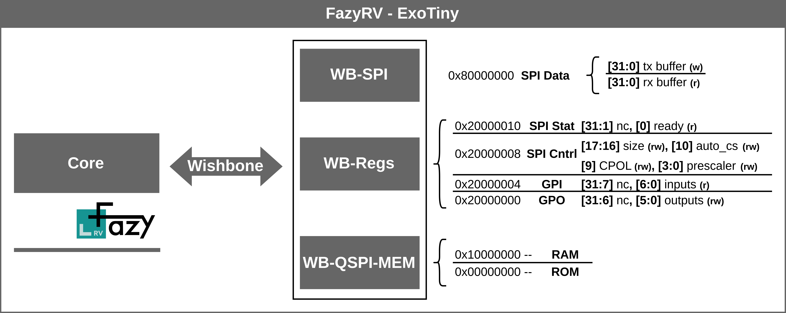

# FazyRV-ExoTiny: A minimal SoC based on FazyRV that uses external QSPI ROM and RAM.

FazyRV-ExoTiny implements a minimal System-on-Chip based on the FazyRV RISC-V core. It targets platforms that do not have on-chip memory available through external QSPI RAM and ROM memory. This repository is tailored to a particular use case. We recommend taking a look at the documentation given in [FazyRV](https://github.com/meiniKi/fazyrv).

## Table of Content
- [Introduction](#intro)
- [Quick Start](#quick)
  - [Environment](#env)
  - [riscv-tests](#riscvtests)
  - [RISCOF](#riscof)

## Introduction <a name="intro"></a>



> [!IMPORTANT]  
> FazyRV-ExoTiny is designed to showcase FazyRV in specific scenarios when on-chip memory is not available. We highly recommend re-verifying the design when adopting it. 

> [!WARNING]  
> WIP! Full verification is yet to be done.

## Quick Start <a name="quick"></a>

### Prepare the Environment <a name="env"></a>

Init the submodules recursively.

```shell
git submodule update --init --recursive
```

You may want to use a Python virtual environment.

```shell
python3 -m venv .venv
source .venv/bin/activate
pip install -r requirements.txt
```

Start by adding core files to the fusesoc library.

```shell
fusesoc library add exotiny .
```

### Run riscv-tests <a name="riscvtests"></a>

To run the riscv-tests with default options, run the following make target. The FazyRV variant may be overwritten by setting environment variables.

```shell
# riscv-tests
cd sim
make test
# or
make test_vcd
```

### Run RISCOF tests <a name="riscof"></a>

The RISCOF framework provides more extensive simulation-based design tests.

```shell
# RISCOF
make riscof.prepare
make riscof.run.<CHUNKSIZE>-<CONF>-<RFTYPE>
# e.g.,
make riscof.prepare
make riscof.run.2-MIN-BRAM
```

